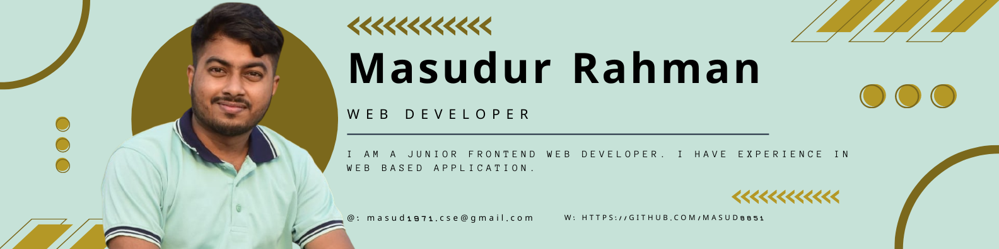

<!--
**Masud8851/Masud8851** is a ✨ _special_ ✨ repository because its `README.md` (this file) appears on your GitHub profile.

Here are some ideas to get you started:
- 🔭 I’m currently working on ...
- 🌱 I’m currently learning ...
- 👯 I’m looking to collaborate on ...
- 🤔 I’m looking for help with ...
- 💬 Ask me about ...
- 📫 How to reach me: ...
- 😄 Pronouns: ...
- ⚡ Fun fact: ...

-->

### <h1 align="center"> Hello, I'm [Masudur Rahman!](https://masudur-personal-portfolio.netlify.app)     [+Developer;Always+Learning+new+techonologies)](https://git.io/typing-svg) </h1>

A self-taught, passionate and fast-learner full-stack developer 🎯 from Dhaka, 🇧🇩 🌎. I love to work with new technologies and developing web applications like ReactJs 🔭. Currently, I am learning how to improve the performance of both responsive and progressive web applications for better user experience 🌱. I’m looking to apply my skills as part of a fast-placed, quality-driven team in order to build better experiences on the web-development 🚀

### Here are some ideas about me
- 🎓 Graduated from [Daffodil International University](https://daffodilvarsity.edu.bd/).
- 🔭 <b>Currently working on:</b> ReactJs.
- 🌱 <b>Getting better at:</b> Javascript and ES6.
- 🎯 2022 Goals: **Master React,Complete Rest Full API development, Complete MERN Stack. Contribute to Open Source projects.**
- 🌇 Fun Fact: I really love to travel and explore new things and new places in my free time.
- 📝 Please have a look at my [Resume](https://drive.google.com/file/d/1wkiK--OJw-cPIb4YzDkVaOSy1LiDC5oQ/view?usp=sharing) for more details about me. I'm open to feedback and suggestions!
- 📫 My Portfolio: [Masudur Rahman](https://masudur-personal-portfolio.netlify.app/).
- 💬 <b>Ask me about:</b>  Js, ES6, ReactJs.

 

## 👨‍💻 Languages and Tools:

## 🏆 GitHub Stats

## 🚀 Where to find me
  

### Show some ❤️ by starring ⭐ some of the repositories!

